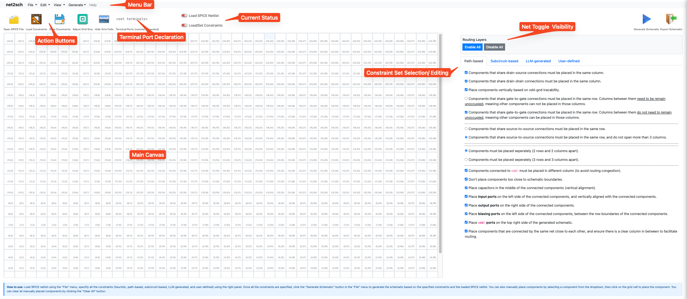

### 
<div align="center">
  <p>
      <a href="#">
        
      </a>
    <h2>schengen: Constraint-Guided Schematic Generation for Analog Circuits via Large Language Models</h2>
  </p>
</div>

## Overview

**schengen** is an open-source **Netlist-to-Schematic Conversion** tool designed specifically for analog SPICE netlists/components.

We aim to provide a tool for schematic generation from SPICE input netlists using predefined constraint primitives and an iterative web-based interface.
A set of constraints from multiple sources (path-based circuit analysis, subcircuit recognition, LLM-generated constraints, and user-defined constraints) is used to determine component locations on a grid-based canvas. Then, OR-Tools is used to find the optimal placement solutions, and finally, the A* routing algorithm is applied to generate the complete schematic.

## Constraint Primitives

Below is a list of publicly available constraint primitives that can be used for constraint set generation/construction. This serves as the basis for LLMs to reason about and construct constraint sets to guide the schematic generation process. Human designers can additionally choose different constraint primitives to further refine schematic quality and standards. More details are described in the **Quick Start** section and in our corresponding paper.


|    | **Constraint**                              | **Description**                                                                                                  |
|----|---------------------------------------------|------------------------------------------------------------------------------------------------------------------|
| 1  | `["above","A","B"]`                         | A is above B                                                                                                     |
| 2  | `["below","A","B"]`                         | A is below B                                                                                                     |
| 3  | `["left_of","A","B"]`                       | A is on the left of B                                                                                            |
| 4  | `["right_of","A","B"]`                      | A is on the right of B                                                                                           |
| 5  | `["same_row","A","B"]`                      | A and B share the same row                                                                                       |
| 6  | `["same_column","A","B"]`                   | A and B share the same column                                                                                    |
| 7  | `["same_column_above","A","B"]`             | A and B share the same column, and A is above B                                                                  |
| 8  | `["same_column_below","A","B"]`             | A and B share the same column, and A is below B                                                                  |
| 9  | `["between_row","A","B","C",...,"X"]`       | A should be placed between the minimum and maximum rows of "B","C",...,"X" (the column can be different)   |
| 10 | `["between_row","A","B","C",...,"X"]`       | A should be placed between the minimum and maximum columns of "B","C",...,"X" (the row can be different)   |
| 11 | `["clear_row_between","A","B"]`             | Keep rows between A and B clear (there is no component placed in the same column between the rows of A and B)   |
| 12 | `["clear_column_between","A","B"]`          | Keep columns between A and B clear (there is no component placed in the same row between the columns of A and B) |
| 13 | `["row_proximity",n,"A","B"]`               | Keep the row of A close to B (within `n` cell distance)                                                          |
| 14 | `["column_proximity",n,"A","B"]`            | Keep the column of A close to B (within `n` cell distance)                                                       |
| 15 | `["cluster_proximity",n,"A","B",...,"X"]`   | Keep A, B, ..., X close to each other (row and column), within `n` cell distance                                |
| 16 | `["t_junction","A","B","C"]`                | Keep B and C in the same row, with A in between them (and in a different row from B and C)                      |

## Quick Start

Prerequisites: `uv` [https://docs.astral.sh/uv/](https://docs.astral.sh/uv/)


### 1. Installation

First, `git clone` this repository, and then run the following command to start the web-based interface.

```bash
uv run src/ui/app.py
```

This starts a local Flask web application running on port `5555`.


If you are hosting **schengen** on a remote server and want to access the web interface locally, use the following command for port forwarding:

```bash
ssh -L <local-port>:127.0.0.1:5555 <username>@<ip-address>

# then you can access schengen in your local web browser via: http://localhost:<local-port>
```

Open your web browser and visit `http://localhost:<port>`. You should see the schengen interface as shown below:

<p align="center">
  
</p>

### 2. Schematic Generation with schengen via Web Interface

The functionality of each section is illustrated above. You can find all supported features in the menu bar or via action buttons. The general workflow is as follows:

1. **Loading Netlist Input**: Upload a SPICE netlist from your local machine using the **Open SPICE File** button, `File → Load SPICE Netlist`, or `Ctrl + O`. When the SPICE netlist is loaded successfully, the red indicator in the [Current Status] section turns green.

> [!IMPORTANT]  
> In the current implementation, the positive supply power net (if it exists) should be standardized to `vdd!`. For the ground supply (if it exists), it can be renamed to `gnd!` to use the GND symbol (see Examples 1 and 2) for ground connections. Alternatively, any other net name can be used; in this case, ground is treated as a regular net (see Example 3).
successful loading. In addition, the input netlist should use the `.ckt` extension and contain only component/net definition information. Please do not use a hierarchical structure in the netlist input (i.e., avoid placing the netlist inside a `.subckt` block).

2. **Loading Constraint File**: If you already have a corresponding constraint file, load it using the **Load Constraints** button, `File → Load Constraint Setting File`, or `Ctrl + P`. When the constraint file is loaded successfully, the red indicator in the [Current Status] section turns green.

3. **Defining Terminal Ports**: We need to define the terminals/ports of the input SPICE circuits. Typically, ports include input ports (e.g., `in1`, `in2`), output ports (`out+`, `out-`), and power supply ports (`gnd!`, `vdd!`). These ports should be provided in the **Terminal Port Declaration** section, and each port should be separated by a comma. For example: `in1,in2,out+,out-,vdd!,gnd!`, without any spaces in between. Note that we can ignore this step if it is already included in the loaded constraint file.

4. **Defining Constraints**: In case you do not have a corresponding constraint file (i.e., you are starting from scratch), you can manually specify suitable constraints in the **Constraint Set Selection/Editing** section.
    - For the **Path-based Constraint** tab, several constraints are enabled by default. These are generally relaxed and suitable for most SPICE netlists. A practical approach is to start with the default settings and gradually add 1–2 constraints at a time (i.e., by selecting relevant radio/checkbox buttons) to see whether the tool can still find a valid placement result. In some cases, adding too many constraints at once may lead to conflicts and prevent valid placement solutions from being found.

    - For the **Subcircuit-based Constraint** tab, subcircuit information is defined as a Python-like dictionary where *the key* follows the format: `<subcircuit-standard-name>[index]`. The valid `<subcircuit-standard-name>` options include:

      ```text
      MosfetCascodeAnalogInverterNmosDiodeTransistor
      MosfetCascodedAnalogInverter
      MosfetFourTransistorCurrentMirror
      MosfetDifferentialPair
      MosfetSimpleCurrentMirror
      MosfetCascodedNMOSAnalogInverter
      MosfetPmosNonInvertingInverter
      MosfetAnalogInverter
      MosfetNmosDiodeAnalogInverter
      ```

      For more details about predefined constraints corresponding to each subcircuit template, please refer to the implementation at: `src/constraints/library.py`.

      The `index` value can be any integer value. In the current implementation, the presence of `index` is only used to ensure that there are no duplicate keys. Later on, this value can be used for visualizing multiple subcircuits in the generated schematics.

      The *corresponding value* is a list of component names. Pay attention to the order here (double-check with the implementation at `src/constraints/library.py`), as the order of components matters.

      The following is an example of valid subcircuit-based constraint information that can be provided to schengen.

      ```bash
        {
          "MosfetCascodedNMOSAnalogInverter[1]": ["m10", "m12", "m14"], 
          "MosfetCascodedNMOSAnalogInverter[2]": ["m11", "m13", "m15"],
          "MosfetPmosNonInvertingInverter[1]": ["m1", "m4"],
          "MosfetAnalogInverter[1]": ["m17", "m24"],
          "MosfetDifferentialPair[1]": ["m20", "m21"],
          "MosfetDifferentialPair[2]": ["m23", "m22"],
          "MosfetDifferentialPair[3]": ["m6", "m7"],
          "MosfetNmosDiodeAnalogInverter[1]": ["m2", "m26"],
          "MosfetNmosDiodeAnalogInverter[2]": ["m17", "m16"],
          "MosfetSimpleCurrentMirror[1]": ["m3", "m4", "m5"],
          "MosfetSimpleCurrentMirror[2]": ["m1", "m17", "m19", "m2"],
          "MosfetSimpleCurrentMirror[3]": ["m25", "m24"],
          "MosfetSimpleCurrentMirror[4]": ["m8", "m10"],
          "MosfetSimpleCurrentMirror[5]": ["m9", "m11"],
          "MosfetSimpleCurrentMirror[6]": ["m16", "m14", "m15"]
        }
      ```

      *Note*: The section for partitioning information has no effect in the current implementation.

    - For the **LLM-generated Constraint** tab, please use the latest prompt template defined at `src/prompts/constraint-generation/v0.0.2.md` to obtain additional constraints from LLMs. Be mindful of the number of generated constraints, as in schengen, each constraint will be added iteratively. The larger the number of included constraints, the longer the "trial-and-error" process will take, leading to longer runtime.

      The following is an example of valid LLM-generated constraints that can be provided to schengen.

      ```bash
      [
        ["above", "m1", "m4"],
        ["above", "m2", "m26"],
        ["left_of", "m26", "m6"],
        ["left_of", "m21", "m22"],
        ["same_row", "m21", "m22"],
        ["same_row", "m24", "m25"],
        ["same_column_above", "m1", "m4"],
        ["same_column_above", "m2", "m26"],
        ["same_column_above", "m8", "m6"],
        ["same_column_above", "m9", "m7"],
        ["same_column_above", "m10", "m12"],
        ...
        ["t_junction", "m5", "m6", "m7"],
        ["t_junction", "m24", "m21", "m22"],
        ["t_junction", "m25", "m20", "m23"]
      ]
      ```

    - For the **User-defined Constraint** tab, users can manually add additional placement constraints using the available constraint primitives. The format for the provided constraint set is identical to the LLM-generated constraint set. Note that we assume all constraints added by users are correct. Therefore, all constraints will be translated into lower-compatible constraints for the OR-Tools solver all at once (without the trial-and-error process used for LLM-generated constraints). Make sure all provided constraints are correct; otherwise, a valid solution may not be found.

      - In addition to placement constraints, users can also specify the orientation of each component in the *Component's Orientation Constraints* section. The provided constraints should be in the form of a Python-like dictionary, following the format:

      ```bash
      {
        "<component-name>": <orientation-value>
      }
      ```

      where `orientation-value` can be found in the component orientation gallery provided in the same section.

      Typically, we can leave this field empty at the beginning and add more orientation constraints after obtaining the initial generated schematics to further refine schematic quality.

5. (Optional) After specifying all constraints, you can save the current constraints to your local machine by selecting **Save Constraints**. This helps with future adjustments when needed.

6. **Generating Schematic**: You can click the **Generate Schematic** button or press `Ctrl+G` to start the schematic generation process. This sends an HTTP request to the underlying Flask API endpoint. The generation process (placement location search with OR-Tools and routing) will take some time, and once it is complete, the generated schematic will be shown on the main canvas.

7. **View & Schematic Refinement**: You can use the hotkey `Ctrl+W` to toggle the visibility of grid cell labels and `Ctrl+Q` to toggle the visibility of grid cell borders. By doing so, you can view the generated schematic with a white background and export it to `.PNG` files. From here, you can inspect each component orientation and add relevant component orientation constraints in the **User-defined Constraint** tab to adjust their orientation (or simply select a component and use the left and right arrow keys to toggle between supported orientation types). Once you finish adding additional orientation constraints, click the **Generate Schematic** button again. This time, schengen will use the existing placement locations, adjust only the orientations, and rerun the routing process. This allows small adjustments to further enhance routing quality.

6. (Optional) As developers, we can also access the `outputs` directory in the top-level directory to view the latest generated schematic (in the form of a JSON file). This file is useful if you want to keep it for future reference or modifications, as you can later load it into the main canvas using `File → Load Schematic File`. Once loaded, you can continue refining it as described in the previous step. In addition, this file contains relevant information for documentation/benchmarking such as the number of net bends, net crossings, HPWL, routing cost, etc.

### 3. Schematic Generation with schengen via Command Line Interface (CLI)

For testing/experimentation, we may want to quickly generate multiple schematics. We can use the following command:

```bash
uv run src/cli.py --ckt=<path-to-spice-netlist-file> --constraint-file=<path-to-constraint-file> --num=10
```

Running this command will generate 10 different schematics, and the results will be saved in the same directory where the netlist file is located under the folder named `output`. We can load, view, and further refine the generated schematics using the menu option: `File → Load Schematic File`.

### 4. Generating LLM Placement Constraints

To generate LLM-based placement constraints for a netlist (using the constraint-generation prompt in `src/prompts/constraint-generation/`), run:

```bash
# OpenAI (default)
export OPENAI_API_KEY=sk-...
uv run python scripts/generate_llm_constraints.py \
  --ckt examples/example-7/netlist.ckt \
  --base-constraint examples/example-7/constraint.json --model gpt-4o

# Claude / Anthropic (default model: claude-opus-4-8)
export ANTHROPIC_API_KEY=sk-ant-...
uv run python scripts/generate_llm_constraints.py \
  --ckt examples/example-7/netlist.ckt \
  --base-constraint examples/example-7/constraint.json --provider anthropic
```

Pick the backend with `--provider {openai,anthropic}` and the model with `--model`. This writes a new `constraint-llm-gen.json` (plus the exact prompt and raw model response) next to the base constraint file, leaving the base file unchanged. Use `--dry-run` to assemble the prompt without calling the API.

### Supported Hotkeys

| Hotkey | Description |
| --- | --- |
| `Ctrl+w` | Toggle grid cell label visibility |
| `Ctrl+q` | Toggle grid cell border visibility |
| `Ctrl+g` | Generate schematic |
| `Ctrl+o` | Open/load input SPICE netlist |
| `Ctrl+p` | Open/load constraint setting file | 
| `Ctrl+s` | Save constraint file |
| `Ctrl+r` | Resize the canvas to match the current browser width |


## License

MIT